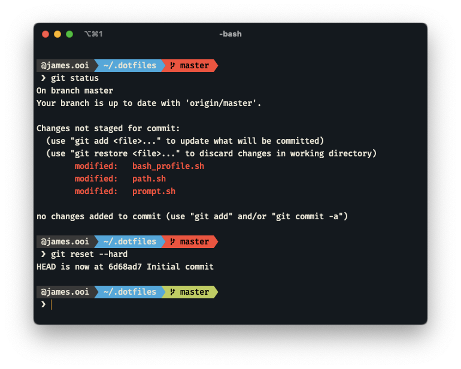

# The Dotfiles of James


## Configurations
* Common Bash configurations
* Common Vim configurations
* Powerline-like PS1 Bash prompt
* Color schemes with good tastes
* Easy `PATH` management

## Installation
Clone this repository into `~/.dotfiles/`
```sh
$ git clone git@github.com:jamesssooi/dotfiles.git ~/dotfiles
```

Update your `.bash_profile ` and `.vimrc` to source the configurations
```sh
# ~/.bash_profile
source ~/.dotfiles/bash_profile.sh

# ~/.vimrc
source ~/.dotfiles/vimrc
```

Restart your terminal session and you're done!

## Advanced Usage

### Extending `$PATH`

This bash configuration comes with a simple script to manage the `$PATH` environment variable. Simply edit `path.sh` and insert your new path in the `paths` variable.

```sh
# path.sh

paths=(
  ...
  "$PATH"
  '/my/path/to/bin'
)
```

### Adding local configurations

To add configurations that are specific to your computer, simply create and add your configurations to `local.sh`. This file will automatically loaded (if available) and is ignored by Git.

```sh
$ vim ~/.dotfiles/local.sh
```

---

Copyright 2021 @ James Ooi